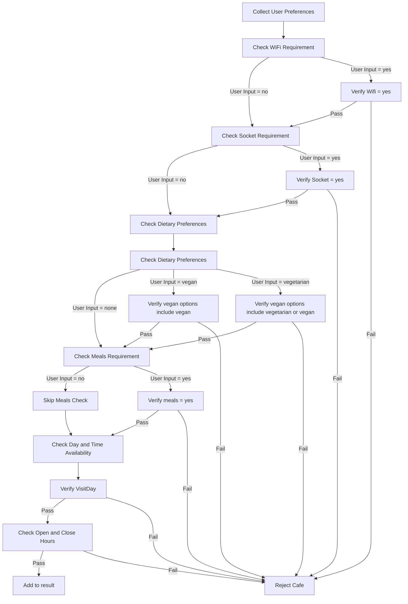

# Cafe Finder Expert System (CS152 Location-based assignment)

**Cafe Finder Expert System** uses Python and Prolog to recommend cafes based on user preferences. The system collects user inputs such as distance, price range, Wi-Fi availability, power sockets, vegan options, meals, and visiting times, and queries a Prolog knowledge base to find suitable cafes.

## Algorithm Visualization

## Features
- Collects user preferences through a simple interactive menu.
- Uses Prolog to query a knowledge base of cafes.
- Displays a list of recommended cafes based on user inputs.

## How It Works
1. **Data Generation**:  
   The `generate_cafes_prolog_file` function in [`generate_list.py`](generate_list.py) generates a Prolog file (`cafes.pl`) from the cafe data in [`cafe_data.py`](cafe_data.py). This function processes the cafe data and writes Prolog facts for each cafe, including details such as address, travel times, price range, Wi-Fi availability, power sockets, vegan/vegetarian options, meals, days opened, and opening/closing hours.

2. **User Input**:  
   The `ask_user` function in [`main.py`](main.py) collects user preferences through an interactive menu. It validates user inputs for correctness and returns a tuple containing the user inputs:
   - `transport` (str): Preferred mode of transport ('walk', 'public_transport', 'taxi').
   - `max_time` (int): Maximum travel time in minutes.
   - `max_price` (int): Maximum price in peso.
   - `wifi` (str): Wi-Fi requirement ('yes'/'no').
   - `sockets` (str): Power socket requirement ('yes'/'no').
   - `vegan_preference` (str): Dietary requirement ('vegan'/'vegetarian'/'none').
   - `needs_meals` (str): Preference for cafes that serve meals ('yes'/'no').
   - `visit_day` (str): Day of the week the user plans to visit.
   - `visit_start` (int): Arrival time in 24-hour format.
   - `visit_end` (int): Departure time in 24-hour format.

3. **Prolog Query**:  
   The `find_cafe` function in [`main.py`](main.py) queries the Prolog knowledge base to find cafes that match the user preferences. It constructs a Prolog query using the user inputs and retrieves matching cafes. The function also retrieves the addresses for each cafe found and combines the results.

4. **Display Results**:  
   The `display_results` function in [`main.py`](main.py) displays the matching cafes in a natural language format with a numbered list. It shows the name, address, and travel time for each cafe based on the user's preferred mode of transport. If no suitable cafes are found, it displays a message indicating that no matches were found.
